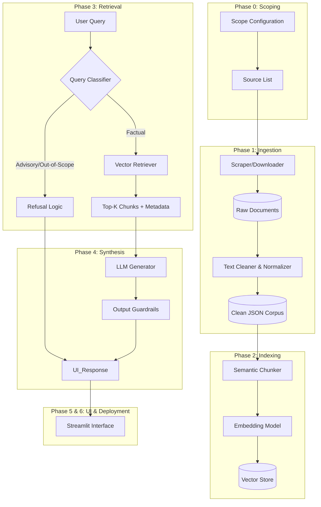

# RAG-based Mutual Fund FAQ Assistant Architecture (Groq API Integrated)

## 1. System Overview

This document outlines the modular, end-to-end system architecture for a **Facts-Only Mutual Fund FAQ Assistant**. The system is designed using **Anti-Gravity principles** to ensure robustness, traceability, and safety. It strictly adheres to a retrieval-augmented generation (RAG) pattern, prioritizing factual accuracy from official sources (AMC, AMFI, SEBI) and explicitly refusing advisory queries.

### Integration Note: Groq API
The system leverages the **Groq API** for ultra-fast LLM inference in **Phase 4 (Generation)**. The low latency of Groq is critical for maintaining a conversational user experience while performing rigorous RAG retrieval and safety checks.

### High-Level Architecture Diagram (Technical)



### Simplified System Diagram (For Presentations)

**Visual Explanation:**
Imagine a pipeline with three main stages:
1.  **Preparation (Offline):** We collect official PDFs (AMFI/SEBI), clean them, break them into small "fact chunks", and store them in a searchable database.
2.  **Processing (Real-time):** When you ask a question, the system first checks if it's safe (advisory/factual). If safe, it searches the database for the *exact* paragraphs containing the answer.
3.  **Response (Real-time):** The system sends your question + the found paragraphs to the **Groq AI**. The AI writes a concise answer citing the source.

**Data Flow Visualization:**
[User Question] -> [Safety Check] -> [Search Database] -> [Found Facts] -> [Groq AI] -> [Final Answer with Citation]

---

## 2. Component Responsibilities & Phases

### Phase 0: Resource Identification & Scoping
**Goal:** Define the boundary of knowledge.
*   **Input:** Domain requirements (Mutual Funds, India).
*   **Key Components:**
    *   `SourceRegistry`: A configuration file (e.g., `sources.yaml`) listing allowed URLs and document types.
    *   `ScopeValidator`: A manual or semi-automated check to ensure sources are official (AMC, AMFI, SEBI).
*   **Output:** `sources_config.json` containing validated URLs and allowed document types.
*   **Thinking Like a Model:** Explicitly defining what is *not* in scope (e.g., unofficial blogs, news sites) prevents hallucination at the source.

### Phase 1: Data Collection, Cleaning & Storage
**Goal:** Create a high-quality, traceable text corpus.
*   **Input:** `sources_config.json`.
*   **Key Components:**
    *   `DocumentScraper`: Fetches PDFs/HTML from allowed URLs.
    *   `TextExtractor`: Extracts raw text (using OCR if necessary for scanned PDFs).
    *   `DataCleaner`: Clears noise (headers, legal disclaimers, tabular data if unstructured).
    *   `MetadataTagger`: Associates every text segment with `source_url`, `document_type`, and `timestamp`.
*   **Output:** `corpus_clean.json` (List of objects: `{ "text": "...", "metadata": {...} }`).
*   **Safety:** Removing irrelevant noise reduces the chance of retrieving wrong context.

### Phase 2: Chunking & Vector Storage
**Goal:** Transform text into retrievable knowledge units.
*   **Input:** `corpus_clean.json`.
*   **Key Components:**
    *   `SemanticChunker`: Splits text into "facts". Ideally 1 fact per chunk.
    *   `EmbeddingGenerator`: Converts chunks to dense vectors (e.g., OpenAI, HuggingFace embeddings).
    *   `VectorStoreManager`: Manages the vector database (e.g., FAISS, ChromaDB, Pinecone).
*   **Output:** Indexed Vector Database.
*   **Traceability:** Every chunk retains its metadata (Source URL) through the embedding process.

### Phase 3: Retrieval Layer
**Goal:** Retrieve the most relevant *factual* context.
*   **Input:** User Query string.
*   **Key Components:**
    *   `QueryRouter/Classifier`: Determines intent.
        *   *Advice* -> Route to Refusal.
        *   *Fact* -> Route to Retriever.
    *   `HybridRetriever`: Performs semantic search (vector) + keyword search (BM25) for precision.
    *   `ReRanker` (Optional): Re-ranks retrieved chunks to maximize relevance.
*   **Output:** List of `Top-K Chunks` with their metadata sources.

### Phase 4: LLM Integration (Groq API)
**Goal:** Synthesize a strictly grounded answer using high-speed inference.
*   **Input:** User Query + Top-K Chunks.
*   **Key Components:**
    *   `GroqClient`: Wrapper for the Groq API (e.g., using `groq-sdk` python library).
        *   **Model Selection:** `llama3-70b-8192` or `mixtral-8x7b-32768` for best reasoning/speed balance.
    *   `PromptEngine`: Constructs the system prompt with strict constraints.
        *   **System Prompt:** "You are a helpful assistant. Answer ONLY using the provided context. If the answer is not in the context, say 'I don't know'. Do not provide financial advice."
        *   **Formatting:** "Keep answers under 3 sentences."
    *   `CitationInjector`: Appends source URLs from the retrieved chunks to the final response.
*   **Output:** Final answer string + Citation.
*   **Guardrails:** The prompt explicitly forbids financial advice.

### Phase 5: UI Layer
**Goal:** Simple, transparent user interaction.
*   **Input:** User interaction.
*   **Key Components:**
    *   `ChatInterface`: Input box and chat history display.
    *   `DisclaimerBanner`: "Not investment advice. For information only."
    *   `CitationDisplay`: Renders sources clearly below the answer.
*   **Output:** Rendered HTML/Streamlit components.

### Phase 6: Deployment (Streamlit)
**Goal:** Operationalize the system.
*   **Input:** All previous modules.
*   **Key Components:**
    *   `app.py`: Main entry point.
    *   `SessionState`: Manages temporary chat history (stateless between reloads preferred for safety).
    *   `ConfigLoader`: Loads environment variables (GROQ_API_KEY).
*   **Output:** Running web application.

---

## 3. Data Flow

1.  **Ingestion:** `Config` -> `Scraper` -> `Cleaner` -> `JSON Corpus`.
2.  **Indexing:** `JSON Corpus` -> `Chunker` -> `Embedder` -> `Vector DB`.
3.  **Runtime:**
    *   `User Query` -> `Classifier`.
    *   *If Factual:* -> `Retriever` (queries DB) -> `Context`.
    *   `Context` + `Query` -> `Groq Retrieval Client` -> `Answer` -> `UI`.
    *   *If Advisory:* -> `Pre-canned Refusal` -> `UI`.

---

## 4. Suggested Folder Structure

Highly modular structure to separate concerns.

```text
mututal_fund_rag/
├── data/
│   ├── raw/                  # Downloaded PDFs/HTML
│   ├── processed/            # Cleaned JSON files
│   └── vector_store/         # Local vector DB files
├── src/
│   ├── config.py             # Configuration (paths, constants)
│   ├── ingestion/
│   │   ├── scraper.py        # Phase 1
│   │   ├── cleaner.py        # Phase 1
│   │   └── loader.py         # Phase 1
│   ├── indexing/
│   │   ├── chunker.py        # Phase 2
│   │   └── embedder.py       # Phase 2
│   ├── retrieval/
│   │   ├── retriever.py      # Phase 3
│   │   └── router.py         # Phase 3 (Intent Classification)
│   ├── generation/
│   │   ├── llm_client.py     # Phase 4 (Groq Client)
│   │   └── prompts.py        # Phase 4 (Strict prompts)
│   └── ui/
│       └── layout.py         # Phase 5 (Helper UI components)
├── tests/                    # Unit and Integration tests
├── app.py                    # Phase 6 (Main Streamlit App)
├── requirements.txt
├── README.md
└── .env                      # API Keys (GROQ_API_KEY)
```

## 5. Modularity, Traceability & Safety

*   **Modularity:** Each phase is a separate module in `src`. You can swap the Vector DB or LLM (e.g., switch Groq model) without rewriting the scraper or UI.
*   **Traceability:** The "Source URL" is captured in Phase 1 and *never* dropped. It travels through the embedding metadata (Phase 2), is retrieved (Phase 3), and is required by the Prompt (Phase 4) to be displayed in the UI (Phase 5).
*   **Safety (Thinking Like a Model):**
    *   **Intent Classification:** We do not rely on the LLM to "just be safe". We explicitly classify the query *before* retrieval. If it asks "Which fund is best?", the retrieval layer is skipped entirely, and a hard-coded refusal is returned.
    *   **System Prompt:** The prompt is the final line of defense, instructed to never give advice and only use provided facts.
